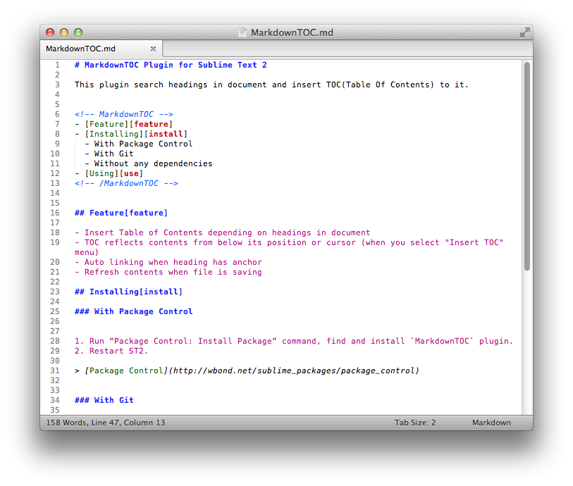

# MarkdownTOC Plugin for Sublime Text

This plugin search headings in document and insert TOC(Table Of Contents) to it.



## Feature

- Insert Table of Contents depending on headings in document
- TOC reflects contents from below its position or cursor (when you select "Insert TOC" menu)
- Auto linking when heading has anchor
- Refresh contents when file is saving
- Depth control

## Installing

With Package Control:


1. Run “Package Control: Install Package” command, find and install `MarkdownTOC` plugin.
2. Restart ST.

> [Package Control](http://wbond.net/sublime_packages/package_control)


With Git:

for SublimeText 2 (Mac)
```sh
git clone git@github.com:naokazuterada/MarkdownTOC.git ~/Library/Application\ Support/Sublime\ Text\ 2/Packages/MarkdownTOC
```

for SublimeText 3 (Mac)
```sh
git clone git@github.com:naokazuterada/MarkdownTOC.git ~/Library/Application\ Support/Sublime\ Text\ 3/Packages/MarkdownTOC
```

Without any dependencies:

1. [Download zip](https://github.com/naokazuterada/MarkdownTOC/archive/master.zip) and expand it.
2. Open ST's "Packges" directory (Sublime Text > Preference > Browse Packages...).
3. Move "MarkdownTOC" directory into "Packages" directory.


## Using

1. Open Markdown files.
2. Move cursor to position where you want to insert TOC.
3. Tools > MarkdownTOC > Insert TOC
4. TOC has inserted into document!
5. Update contents and save...
6. TOC has been updated.

***Don't remove the comment tags if you want to update every time saving.***

## Depth control

You can control TOC depth in its comment tags.

```
<!-- MarkdownTOC depth=2 -->

- foo
  - bar
  - buz
- qux

<!-- /MarkdownTOC -->
```
```
<!-- MarkdownTOC depth=3 -->

- foo
  - bar
    - qux
    - quux
  - buz
- qux

<!-- /MarkdownTOC -->
```

You can also set default depth in Settings.

Preference > Package Settings > MarkdownTOC > Settings - User

```
{
  "default_depth": 0
}
```

`depth=0` means no limit

===

The MIT License

Copyright (c) 2013 Naokazu Terada

Permission is hereby granted, free of charge, to any person obtaining a copy of this software and associated documentation files (the "Software"), to deal in the Software without restriction, including without limitation the rights to use, copy, modify, merge, publish, distribute, sublicense, and/or sell copies of the Software, and to permit persons to whom the Software is furnished to do so, subject to the following conditions:

The above copyright notice and this permission notice shall be included in all copies or substantial portions of the Software.

THE SOFTWARE IS PROVIDED "AS IS", WITHOUT WARRANTY OF ANY KIND, EXPRESS OR IMPLIED, INCLUDING BUT NOT LIMITED TO THE WARRANTIES OF MERCHANTABILITY, FITNESS FOR A PARTICULAR PURPOSE AND NONINFRINGEMENT. IN NO EVENT SHALL THE AUTHORS OR COPYRIGHT HOLDERS BE LIABLE FOR ANY CLAIM, DAMAGES OR OTHER LIABILITY, WHETHER IN AN ACTION OF CONTRACT, TORT OR OTHERWISE, ARISING FROM, OUT OF OR IN CONNECTION WITH THE SOFTWARE OR THE USE OR OTHER DEALINGS IN THE SOFTWARE.
