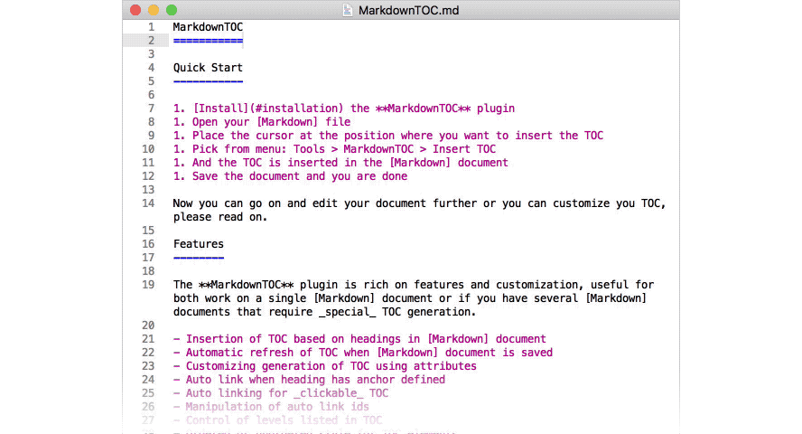
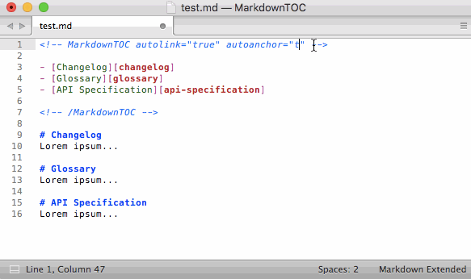

MarkdownTOC
===========

Sublime Text 3 plugin for generating a Table of Contents (TOC) in a Markdown document.

[](https://travis-ci.org/naokazuterada/MarkdownTOC) [](https://ci.appveyor.com/project/naokazuterada/markdowntoc/branch/master) [](https://codecov.io/gh/naokazuterada/MarkdownTOC) [](https://packagecontrol.io/packages/MarkdownTOC) [](https://gitter.im/naokazuterada/MarkdownTOC)

---

***Note: v3.0.0 has breaking changes. See [Upgrade Guide](https://github.com/naokazuterada/MarkdownTOC/releases/tag/3.0.0) for more detail.***

---

## Table of Contents

<details>
 <summary>Click to open TOC</summary>
<!-- MarkdownTOC autolink="true" levels="1,2,3,4,5,6" bracket="round" style="unordered" indent="    " autoanchor="false" markdown_preview="github" -->

- [Quick Start](#quick-start)
- [Features](#features)
    - [Insertion of TOC based on headings in Markdown document](#insertion-of-toc-based-on-headings-in-markdown-document)
    - [Automatic refresh of TOC when Markdown document is saved](#automatic-refresh-of-toc-when-markdown-document-is-saved)
        - [Supported file extensions](#supported-file-extensions)
    - [Customizing generation of TOC using attributes](#customizing-generation-of-toc-using-attributes)
    - [Auto anchoring when heading has anchor defined](#auto-anchoring-when-heading-has-anchor-defined)
    - [Auto linking for _clickable_ TOC](#auto-linking-for-_clickable_-toc)
        - [Lowercasing in ids](#lowercasing-in-ids)
            - [Preserve case](#preserve-case)
            - [Lowercase all characters](#lowercase-all-characters)
        - [Manipulation of auto link ids](#manipulation-of-auto-link-ids)
        - [URI encoding](#uri-encoding)
        - [Markdown Preview compatible](#markdown-preview-compatible)
        - [Link Prefix](#link-prefix)
    - [Control of levels listed in TOC](#control-of-levels-listed-in-toc)
    - [Ordered or unordered style for TOC elements](#ordered-or-unordered-style-for-toc-elements)
    - [Customizable list bullets in TOC](#customizable-list-bullets-in-toc)
    - [Specify custom indentation prefix](#specify-custom-indentation-prefix)
    - [Preserve images in headings](#preserve-images-in-headings)
    - [Excluded headings](#excluded-headings)
- [Usage](#usage)
- [Tips](#tips)
    - [How to remove anchors added by MarkdownTOC](#how-to-remove-anchors-added-by-markdowntoc)
    - [Addressing issues with Github Pages](#addressing-issues-with-github-pages)
    - [Using MarkdownTOC with Markdownlint](#using-markdowntoc-with-markdownlint)
- [Limitations](#limitations)
    - [Headings in lists are not included in the auto-generated table of contents](#headings-in-lists-are-not-included-in-the-auto-generated-table-of-contents)
- [Attributes](#attributes)
- [Installation](#installation)
    - [Using Package Control](#using-package-control)
    - [From Git](#from-git)
    - [From downloadable archive](#from-downloadable-archive)
- [Configuration](#configuration)
    - [Github Configuration](#github-configuration)
    - [Configuration and Collaboration](#configuration-and-collaboration)
- [Compatibility](#compatibility)
- [Contributing](#contributing)
- [License](#license)
- [Author](#author)
- [References](#references)
    - [Markdown Table of Contents Generators](#markdown-table-of-contents-generators)
    - [Recommended plugins for use with MarkdownTOC](#recommended-plugins-for-use-with-markdowntoc)

<!-- /MarkdownTOC -->
</details>

## Quick Start

1. [Install](#installation) the **MarkdownTOC** plugin
1. Open your [Markdown] file
1. Place the cursor at the position where you want to insert the TOC
1. Pick from menu: Tools > MarkdownTOC > Insert TOC
1. And the TOC is inserted in the [Markdown] document
1. Save the document and you are done

Now you can go on and edit your document further or you can customize you TOC, please read on.

## Features

The **MarkdownTOC** plugin is rich on features and customization, useful for both work on a single [Markdown] document or if you have several [Markdown] documents that require _special_ TOC generation.

- [Insertion of TOC based on headings in Markdown document](#insertion-of-toc-based-on-headings-in-markdown-document)
- [Automatic refresh of TOC when Markdown document is saved](#automatic-refresh-of-toc-when-markdown-document-is-saved)
- [Customizing generation of TOC using attributes](#customizing-generation-of-toc-using-attributes)
- [Auto anchoring when heading has anchor defined](#auto-anchoring-when-heading-has-anchor-defined)
- [Auto linking for _clickable_ TOC](#auto-linking-for-clickable-toc)
    - [Lowercasing in ids](#lowercasing-in-ids)
        - [Preserve case](#preserve-case)
        - [Lowercase all characters](#lowercase-all-characters)
    - [Manipulation of auto link ids](#manipulation-of-auto-link-ids)
    - [URI encoding](#uri-encoding)
    - [Markdown Preview compatible](#markdown-preview-compatible)
    - [Link Prefix](#link-prefix)
- [Control of levels listed in TOC](#control-of-levels-listed-in-toc)
- [Ordered or unordered style for TOC elements](#ordered-or-unordered-style-for-toc-elements)
- [Customizable list bullets in TOC](#customizable-list-bullets-in-toc)
- [Specify custom indentation prefix](#specify-custom-indentation-prefix)
- [Preserve images in headings](#preserve-images-in-headings)
- [Excluded headings](#excluded-heading)

### Insertion of TOC based on headings in Markdown document

When you have completed the [installation](#installation) of the plugin, you can insert an automatically generated TOC based on your [Markdown] headings. See the [Quick Start](#quick-start) to get going or the [Usage section](#usage) for details on how to utilize customization and [configuration](#configuration).

For the following sample [Markdown] document:

```markdown

# Heading 0

Headings before MarkdownTOC tags will be ignored.

◀ place the cursor here and generate the TOC

# Heading 1
Lorem ipsum...

## Heading 2
Lorem ipsum...
```

The **MarkdownTOC** plugin will out of the box generate:

```markdown
# Heading 0

Headings before MarkdownTOC tags will be ignored.

<!-- MarkdownTOC -->

- Heading 1
  - Heading 2

<!-- /MarkdownTOC -->

# Heading 1
Lorem ipsum...

## Heading 2
Lorem ipsum...
```

As you can read from the sample above:

1. Headings above the `MarkdownTOC` tag section are ignored, only the rest of the document is considered _in scope_

### Automatic refresh of TOC when Markdown document is saved

If we edit the [Markdown] document some more and add an additional heading:

```markdown
## Heading 3
```

When we save the document, the TOC is automatically updated.

```markdown
<!-- MarkdownTOC -->

- Heading 1
  - Heading 2
  - Heading 3

<!-- /MarkdownTOC -->

# Heading 1
Lorem ipsum...

## Heading 2
Lorem ipsum...

## Heading 3
Lorem ipsum... (the added text)
```

Same goes for deleted headings, these are cleared out.

Updating the TOC can also be accomplished without saving by picking from the menu: Tools > MarkdownTOC > Update TOC

#### Supported file extensions

Make sure your file's extension is in the following list.

`.md` `.markdown` `.mdown` `.mdwn` `.mkdn` `.mkd` `.mark`

### Customizing generation of TOC using attributes

```markdown
<!-- MarkdownTOC autolink="true" -->

- [Heading 1](#heading-1)
  - [Heading 2](#heading-2)
  - [Heading 3](#heading-3)

<!-- /MarkdownTOC -->

# Heading 1
Lorem ipsum...

## Heading 2
Lorem ipsum...

## Heading 3
Lorem ipsum... (the added text)
```

1. TOC tags can overwrite default [attributes](#Attributes) using local settings and influence the rendering of the TOC. See: [Configuration](#configuration) on how to set your own defaults for the plugin
1. Headings can be automatically linked (see: [auto link](#auto-link))
1. Headings can have anchors automatically linked (see: [Auto anchoring when heading has anchor defined](#auto-anchoring-when-heading-has-anchor-defined))

The default behaviour could also be described as:

```markdown
<!-- MarkdownTOC levels="1,2,3,4,5,6" autolink="false" bracket="round" autoanchor="false" style="unordered" indent="\t" -->
```

Please see: [Github Configuration](#github-configuration) for a guideline to configuring **MarkdownTOC** for [Github] use.

### Auto anchoring when heading has anchor defined

You can add an HTML anchor (`<a name="xxx"></a>`) before your heading automatically.

```markdown
# Heading with anchor [with-anchor]
```

The TOC generation can be specified to respect this and a TOC element of the following format is generated:

```markdown
- [Heading with anchor](#with-anchor)
```

Please note that the default for the attribute: [autoanchor](#autoanchor) is `false`.You can add an HTML anchor (`<a name="xxx"></a>`) before the heading automatically.

```markdown
<!-- MarkdownTOC autolink="true" autoanchor="true" -->

- [Changelog](#changelog)
- [Glossary](#glossary)
- [API Specification](#api-specification)

<!-- /MarkdownTOC -->

<a name="changelog"></a>
# Changelog
Lorem ipsum...

<a name="glossary"></a>
# Glossary
Lorem ipsum...

<a name="api-specification"></a>
# API Specification
Lorem ipsum...
```

Please note that the default for autolink is `false` defined by the [attribute](#attributes) `defaults.autoanchor`. See also: [How to remove anchors added by MarkdownTOC](#how-to-remove-anchors-added-by-markdowntoc).

### Auto linking for _clickable_ TOC

The plugin can be specified to auto link heading so you get a TOC with _clickable_ hyperlink elements.

The following sample document:

```markdown
# Heading 1
Lorem ipsum...

## Heading 2
Lorem ipsum...

## Heading 3
Lorem ipsum...
```

With `autolink` set to `true` will render the following:

```markdown
<!-- MarkdownTOC autolink="true" -->

- [Heading 1](#heading-1)
  - [Heading 2](#heading-2)
  - [Heading 3](#heading-3)
  - [Heading 4](#heading-4)
- [Heading with anchor](#with-anchor)

<!-- /MarkdownTOC -->
```

The auto link markup style can be one of:

- `round`, the default, the style supported on [Github]
- `square`, the ["Markdown standard reference-style links"][MarkdownLinks] style.

Please note that the default for autolink is `false` defined by the [attribute](#attributes) `defaults.autolink`.

```markdown
<!-- MarkdownTOC autolink="false" -->

- MarkdownTOC Plugin for Sublime Text
  - Feature
  - Feature
  - Feature

<!-- /MarkdownTOC -->
```
```markdown
<!-- MarkdownTOC autolink="true" -->

- [MarkdownTOC Plugin for Sublime Text](#markdowntoc-plugin-for-sublime-text)
  - [Feature](#feature)
  - [Feature](#feature-1)
  - [Feature](#feature-2)

<!-- /MarkdownTOC -->
```

**round**: according to [Github] style.

```markdown
<!-- MarkdownTOC bracket="round" -->

- [Heading](#heading)

<!-- /MarkdownTOC -->
```

**square**: according to ["Markdown standard reference-style links"][MarkdownLinks].

```markdown
<!-- MarkdownTOC bracket="square" -->

- [Heading][heading]

<!-- /MarkdownTOC -->
```

Please note that the default for bracket is `round` defined by the [attribute](#attributes) `defaults.bracket`.

#### Lowercasing in ids

By default the plugin lowercases ASCII based alphabets **only** (`a` to `z`) for auto links.

```markdown
<!-- MarkdownTOC autolink="true" -->

- [ПРИМЕР EXAMPLE][ПРИМЕР-example]

<!-- /MarkdownTOC -->

# ПРИМЕР EXAMPLE
```

This is same as setting `lowercase` attribute to `only_ascii`.

```markdown
<!-- MarkdownTOC autolink="true" lowercase="only_ascii" -->

- [ПРИМЕР EXAMPLE][ПРИМЕР-example]

<!-- /MarkdownTOC -->

# ПРИМЕР EXAMPLE
```

##### Preserve case

You can disable the lowercasing capability by setting the `lowecase` attribute to `false`.

```markdown
<!-- MarkdownTOC autolink="true" lowercase="false" -->

- [One Two Three][One-Two-Three]

<!-- /MarkdownTOC -->

# One Two Three
```

##### Lowercase all characters

Further more you can also expand the lowercasing capability by setting the `lowercase` attribute to `all`(or any values other than `false` and `only_ascii`).

```markdown
<!-- MarkdownTOC autolink="true" lowercase="all" -->

- [ПРИМЕР EXAMPLE][пример-example]

<!-- /MarkdownTOC -->

# ПРИМЕР EXAMPLE
```

You can also specify this in your [configuration](#configuration) with key `defaults.lowercase`.

#### Manipulation of auto link ids

You can manipulate your link ids in your [configuration](#configuration) using the key `id_replacements`.

```json
{
  "id_replacements": [
    {
      "pattern": "\\s+",
      "replacement": "-"
    },
    {
      "pattern": "!|#|$|&|'|\\(|\\)|\\*|\\+|,|/|:|;|=|_|\\?|@|\\[|\\]|`|\"|\\.|<|>|{|}|™|®|©|&lt;|&gt;|&amp;|&apos;|&quot;|&#60;|&#62;|&#38;|&#39;|&#34;",
      "replacement": ""
    }
  ]
}
```

1. Regular expression is allowed in each sets
    - It will be simply expanded into python's `re.sub(pattern, replacement, id)`
2. The replacement sequence executes from top to bottom

An example:

```markdown
# Super Product™
```

This heading link of this heading is changed to following id

```markdown
#super-product
```

- The `' '` (space) is replaced with `-` (dash), since `' '` is included in the first set
- The '™' is replaced with _nothing_, since '™' is included in the second set

#### URI encoding

By default non-ASCII characters in link ids are [URL encoded](https://en.wikipedia.org/wiki/Percent-encoding).

```markdown
<!-- MarkdownTOC autolink="true" -->

- [Ejemplos de español](#ejemplos-de-espa%C3%B1ol)
- [日本語の例](#%E6%97%A5%E6%9C%AC%E8%AA%9E%E3%81%AE%E4%BE%8B)
- [Примеры русского](#%D0%9F%D1%80%D0%B8%D0%BC%D0%B5%D1%80%D1%8B-%D1%80%D1%83%D1%81%D1%81%D0%BA%D0%BE%D0%B3%D0%BE)
- [中国的例子](#%E4%B8%AD%E5%9B%BD%E7%9A%84%E4%BE%8B%E5%AD%90)

<!-- /MarkdownTOC -->

# Ejemplos de español
# 日本語の例
# Примеры русского
# 中国的例子
```

As mentioned you can disable this by setting the `uri_encoding` attribute to `false`, like so: `uri_encoding="false"`.

```markdown
<!-- MarkdownTOC autolink="true" uri_encoding="false" -->

- [Ejemplos de español](#ejemplos-de-español)
- [日本語の例](#日本語の例)
- [Примеры русского](#Примеры-русского)
- [中国的例子](#中国的例子)

<!-- /MarkdownTOC -->

# Ejemplos de español
# 日本語の例
# Примеры русского
# 中国的例子
```

#### Markdown Preview compatible

If you want to use **MarkdownTOC** with [Markdown Preview][MarkdownPreview], you should use `markdown_preview` attribute.
You can set this attribute to either `markdown` or `github`.

When you set it to `markdown`, you can get same links rendered by MarkdownPreview's markdown parser.

```markdown
<!-- MarkdownTOC autolink="true" markdown_preview="markdown" -->

- [Hello 世界 World](#hello-world)
- [ESPAÑA](#espana)
- [ПРИМЕР RUSSIAN](#russian)

<!-- /MarkdownTOC -->

# Hello 世界 World
# ESPAÑA
# ПРИМЕР RUSSIAN
```

When you set it to `github`, you can get same links rendered by MarkdownPreview's github parser.

```markdown
<!-- MarkdownTOC autolink="true" markdown_preview="github" -->

- [Hello 世界 World](#hello-%25E4%25B8%2596%25E7%2595%258C-world)
- [ESPAÑA](#espa%25C3%25B1a)
- [ПРИМЕР RUSSIAN](#%25D0%25BF%25D1%2580%25D0%25B8%25D0%25BC%25D0%25B5%25D1%2580-russian)

<!-- /MarkdownTOC -->

# Hello 世界 World
# ESPAÑA
# ПРИМЕР RUSSIAN
```

Currently no other parsers are supported.

If you want to disable this feature, set it to `false`.

#### Link Prefix

You can also set _prefix_ of links.

```markdown
<!-- MarkdownTOC autolink=true link_prefix="user-content-" -->

- [My Heading](#user-content-my-heading)

<!-- /MarkdownTOC -->

# My Heading
```

You can manipulate this in your [configuration](#configuration) using the key `defaults.link_prefix`.

### Control of levels listed in TOC

```markdown
# Heading 1
Lorem ipsum...

## Heading 2
Lorem ipsum...

### Heading 3
Lorem ipsum...

#### Heading 4
Lorem ipsum...
```

With default levels:

```markdown
<!-- MarkdownTOC -->

- Heading 1
  - Heading 2
    - Heading 3
      - Heading 4

<!-- /MarkdownTOC -->
```

With levels set to 1,2:

```markdown
<!-- MarkdownTOC levels="1,2" -->

- Heading 1
  - Heading 2

<!-- /MarkdownTOC -->
```

Please note that the default for the [attribute](#attributes) levels is `"1,2,3,4,5,6"`, it means all heading sizes will be included.

You can also specify this in your [configuration](#configuration) with key `defaults.levels`.

The maximum size for headings is `6` according to the [Markdown specification][Markdown]

### Ordered or unordered style for TOC elements

The plugin supports two styles of TOC element listing:

- `unordered`
- `ordered`

A [Markdown] document with the following contents:

```markdown
# Heading 1
Lorem ipsum...

## Heading 2
Lorem ipsum...

### Heading 3
Lorem ipsum...

### Heading 4
Lorem ipsum...

## Heading 5
Lorem ipsum...

# Heading 6
Lorem ipsum...
```

Will with style `unordered`:

```markdown
<!-- MarkdownTOC style="unordered" -->

- Heading 1
  - Heading 2
    - Heading 3
    - Heading 4
  - Heading 5
- Heading 6

<!-- /MarkdownTOC -->
```

And with style `ordered`:

```markdown
<!-- MarkdownTOC style="ordered" -->

1. Heading 1
  1. Heading 2
    1. Heading 3
    1. Heading 4
  1. Heading 5
1. Heading 6

<!-- /MarkdownTOC -->
```

Please note that the default for the [attribute](#attributes) is: `unordered`.

You can set your default style in your [configuration](#configuration) with the key `defaults.style`.

### Customizable list bullets in TOC

You can define the list items used for the TOC for each level. The first item is for the first level, the second for the second and so on until the last one of the list and then it starts over from the beginning.

```markdown
<!-- MarkdownTOC bullets="-,+,*" -->

- foo
  + bar
    * baz
      - foo
        + bar
          * baz

<!-- /MarkdownTOC -->
```

You can set default list bullets in your [configuration](#configuration) with the key `defaults.bullets`.

The example above could also be described as:

```json
{
  "defaults": {
    "bullets": ["-","+","*"]
  }
}
```

You can also set it in attribute. In this case the values type is **'conmma separated string'**.

```markdown
<!-- MarkdownTOC bullets="-,+,*" -->
```

### Specify custom indentation prefix

The indentation prefix is a specification of the string used to indent the TOC elements.

An _ugly_ but demonstrative example could be to use an [emoji][emoji].

```markdown
<!-- MarkdownTOC autolink="true" indent=":point_right: " -->

- [Heading 1](#heading-1)
:point_right: - [Heading 2](#heading-2)
:point_right: :point_right: - [Heading 3](#heading-3)
:point_right: :point_right: - [Heading 4](#heading-4)
:point_right: - [Heading 5](#heading-5)
- [Heading 6](#heading-6)

<!-- /MarkdownTOC -->
```

Please note that the default for the [attribute](#attributes) is: `'\t'`.

You can set your default indentation in your [configuration](#configuration) with the key `defaults.indent`.

### Preserve images in headings

If you want to preserve images in headings, set `remove_image` to `false`.

```markdown
<!-- MarkdownTOC remove_image="false" -->

-  Everything is OK

<!-- /MarkdownTOC -->

#  Everything is OK
```

Please note that the default for the [attribute](#attributes) is: `false`.

```markdown
<!-- MarkdownTOC -->

- Everything is OK

<!-- /MarkdownTOC -->

#  Everything is OK
```

You can change your default setting in your [configuration](#configuration) with the key `defaults.remove_image`.

### Excluded headings

You can exclude certain headings in the TOC by adding a special comment to the line above the line with the heading, as shown below.

```markdown
<!-- MarkdownTOC:excluded -->
## This heading will be excluded
```

## Usage

1. Open your [Markdown] file
2. Set cursor to position where you want to insert a TOC
3. Pick from menu: Tools > MarkdownTOC > Insert TOC
4. TOC is inserted in document
5. Evaluate your TOC and customize using [attributes](#attributes) or [configuration](#configuration)
6. Update contents and save...
7. TOC has been updated

***Don't remove the comment tags if you want to update every time saving.***

## Tips

### How to remove anchors added by MarkdownTOC

If you want to remove the TOC again, you do not have to go through your complete Markdown and remove all tags manually - just follow this simple guide (see also: [Auto anchoring when heading has anchor defined](#auto-anchoring-when-heading-has-anchor-defined)).

1. Open your [Markdown] file
2. Set the attribute `autoanchor` to `false`, this clears all anchors

```markdown
<!-- MarkdownTOC autoanchor="false" -->
```

Please see the below animation demonstrating the change



<ol><li value="3">Now delete the TOC section from beginning to end and **MarkdownTOC** integration is gone</li></ol>

```markdown
<!-- MarkdownTOC autoanchor="false" -->

...

<!-- /MarkdownTOC -->
```

Ref: [Github issue #76](https://github.com/naokazuterada/MarkdownTOC/issues/76)

### Addressing issues with Github Pages

If you are using Github Pages you might experience that some themes do not render heading correctly.

This can be addressed simply by setting `autoanchor` to `false`

```markdown
<!-- MarkdownTOC autoanchor="false" -->
```

And when **Jekyll** is done, your headings should render correctly.

Ref: [Github issue #81](https://github.com/naokazuterada/MarkdownTOC/issues/81)

### Using MarkdownTOC with Markdownlint

If you are using [Markdownlint](https://github.com/DavidAnson/markdownlint) (Node implementation), it will report several violations out of the box.

The basic configuration you can use to address these looks like the following:

```json
{
    "html": false,
    "blanks-around-headings": false,
    "ul-indent": {
        "indent": 4
    }
}
```

- `html` set to `false`, to allow use of HTML since **MarkdownTOC** relies on HTML tags to assist the Markdown
- `blanks-around-headings` should be set to `false`, since anchors are places closed to the headings that are listed in the TOC
- `ul-indent` should have it's parameter `indent` set to `4` to adhere with the default of `4` used by **MarkdownTOC**, whereas **Markdownlint** defaults to `2`

If you have configured **MarkdownTOC** differently, you can adjust your **Markdownlint** configuration accordingly.

Do note that this tip is based on the **Node** implementation, [available on GitHub](https://github.com/DavidAnson/markdownlint), which uses a project specific `.markdownlint.json` based configuration.

## Limitations

**MarkdownTOC** does come with some limitations.

For more information on compatibility, please see [the dedicated section](#compatibility).

### Headings in lists are not included in the auto-generated table of contents

Example of [Markdown] heading in a [Markdown] listing, not being included in the auto-generated Table of Contents

```markdown
- # this is a heading
```

## Attributes

The following attributes can be used to control the generation of the TOC.

| attribute              | values                                    | default         |
|:-----------------------|:------------------------------------------|:----------------|
| `autoanchor`           | `true`or`false`                           | `false`         |
| `autolink`             | `true`or`false`                           | `false`         |
| `bracket`              | `"round"`or`"square"`                     | `"round"`       |
| `indent`               | string                                    | `"\t"`          |
| `levels`               | string (decimal list separated with `,`)  | `"1,2,3,4,5,6"` |
| `link_prefix`          | string                                    | `""`            |
| `bullets`              | string                                    | `"-"`           |
| `lowercase`            | `"all"`or`"only_ascii"`or`"false"`        | `"only_ascii"`  |
| `remove_image`         | `true`or`false`                           | `true`          |
| `style`                | `"ordered"` or `"unordered"`              | `"unordered"`   |
| `uri_encoding`         | `true`or`false`                           | `true`          |
| `markdown_preview`     | `""`or`"github"`or`"markdown"`            | `""`            |

You can define your own default values via package preferences, [Sublime Text][SublimeText]'s way of letting users customize [package settings][SublimeTextSettings]. Please see the [Section on Configuration](#Configuration) for more details for **MarkdownTOC**.

## Installation

### Using Package Control

1. Run “Package Control: Install Package” command, find and install `MarkdownTOC` plugin.
2. Restart [Sublime Text][SublimeText]

> [Package Control][PackageControl]

### From Git

```sh
git clone git@github.com:naokazuterada/MarkdownTOC.git ~/Library/Application\ Support/Sublime\ Text\ 3/Packages/MarkdownTOC
```

### From downloadable archive

1. [Download zip-file](https://github.com/naokazuterada/MarkdownTOC/archive/master.zip) and unpack it.
2. Open the [Sublime Text][sublimetext] `Packages/` directory (pick menu: Sublime Text > Preferences > Browse Packages).
3. Move the `MarkdownTOC/` directory into the `Packages/` directory.

## Configuration

You can use [attributes](#attributes) to customize a TOC in a single [Markdown] document, but if you want to keep the same TOC configuration accross multiple [Markdown] documents, you can configure your own defaults.

Pick: `Sublime Text > Preferences > Package Settings > MarkdownTOC > Settings - User`

Alternatively you can create the file `~/Library/Application Support/Sublime Text 3/Packages/User/MarkdownTOC.sublime-settings` by hand.

Example: `MarkdownTOC.sublime-settings`

```json
{
  "defaults": {
    "autolink": true,
    "bracket": "square",
    "levels": "1,2",
    "indent": "    ",
    "remove_image": false,
    "bullets": "*",
    "style": "ordered"
  },
  "id_replacements": [
    {
      "pattern": "\\s+",
      "replacement": "-"
    },
    {
      "pattern": "&lt;|&gt;|&amp;|&apos;|&quot;|&#60;|&#62;|&#38;|&#39;|&#34;|!|#|$|&|'|\\(|\\)|\\*|\\+|,|/|:|;|=|_|\\?|@|\\[|\\]|`|\"|\\.|<|>|{|}|™|®|©",
      "replacement": ""
    }
  ]
}
```

Please see the section on [attributes](#attributes) for an overview of values and the [section on customization](#customizing-generation-of-toc-using-attributes).

Configuration precendence is as follows:

1. Attributes specified in **MarkdownTOC** begin tag (see: [Customizing generation of TOC using attributes](#customizing-generation-of-toc-using-attributes))
1. **MarkdownTOC** Settings - user (this section)
1. **MarkdownTOC** Settings - default (see: [Attributes](#attributes))

For an overview of the specific behaviour behind an attribute, please refer to the below list.

- `defaults.autolink`, (see: [Auto linking for _clickable_ TOC](#auto-linking-for-clickable-toc))
- `defaults.autoanchor`, (see: [Auto anchoring when heading has anchor defined](#auto-anchoring-when-heading-has-anchor-defined))
- `defaults.bracket`, (see: [Auto linking for _clickable_ TOC](#auto-linking-for-clickable-toc))
- `defaults.indent`, (see: [Specify custom indentation prefix](#specify-custom-indentation-prefix))
- `defaults.link_prefix`, (see: [Link Prefix](#link-prefix))
- `defaults.levels`, (see: [Control of levels listed in TOC](#control-of-levels-listed-in-toc))
- `defaults.bullets`, (see: [Customizable list bullets in TOC](#customizable-list-bullets-in-toc))
- `defaults.lowercase`, (see: [Lowercasing in ids](#lowercasing-in-ids))
- `defaults.remove_image`, (see: [Preserve images in headings](#maintain-the-images-in-headings))
- `defaults.style`, (see: [Ordered or unordered style for TOC elements](#ordered-or-unordered-style-for-toc-elements))
- `defaults.uri_encoding`, (see: [URI encoding](#uri-encoding))
- `defaults.markdown_preview`, (see: [Markdown Preview compatible](#markdown-preview-compatible))
- `id_replacements`, (see: [Manipulation of auto link ids](#manipulation-of-auto-link-ids))

### Github Configuration

A configuration for writing Markdown primaily for use on [Github] _could_ look like the following:

```json
{
  "defaults": {
    "autolink": true,
    "bracket": "round",
    "lowercase": "only_ascii"
  }
}
```

### Configuration and Collaboration

You should be aware that if you collaborate with other [Markdown] writers and users of **MarkdownTOC**, you might have changes going back and forth simply due to differing configurations.

If that is the case and you cannot agree on a configuration, choose configuration using attributes specified in the document instead.

Example of attribute configuration for the above configuration settings in file:

```markdown
<!-- MarkdownTOC autolink="true" bracket="round" autoanchor="true" -->
```

## Compatibility

This is by no means an exhaustive list and you are welcome to provide additional information and feedback. Here is listed what Markdown rendering platforms and tools where compatibility and incompatibily has been asserted with the **MarkdownTOC** plugin.

| Application  | Compatibility |
| ------------ | ------------- |
| [Github](https://github.com/) | Compatible |
| [Gitblit](http://gitblit.com/) 1.6.x | Incompatible |
| [Gitlab](https://about.gitlab.com/) 8.10.x | Compatible |
| [BitBucket](https://bitbucket.org/) 5.12.2 | Incompatible |

## Contributing

Contributions are most welcome, please see the [guidelines on contributing](https://github.com/naokazuterada/MarkdownTOC/blob/master/.github/CONTRIBUTING.md).

## License

- **MarkdownTOC** is licensed under the [MIT License](https://github.com/naokazuterada/MarkdownTOC/blob/master/LICENSE-MIT)

## Author

- [Naokazu Terada](https://github.com/naokazuterada)

## References

- [Daring Fireballs Markdown Syntax Specification][Markdown]
- [Sublime Text][SublimeText]
- [Sublime Text: Package Control][PackageControl]
- [Emoji cheatsheet][emoji]
- [GitHub Flavored Markdown][Github]
- [Markdown Preview][MarkdownPreview]

### Markdown Table of Contents Generators

Here follows a list of other Markdown Table of Contents generators, for inspiration and perhaps even use in the situation where the **MarkdownTOC** Sublime Text plugin is _not the right tool for the job_. Please note that the list is by no means authoritative or exhaustive and is not a list of recommendations, since we can only endorse **MarkdownTOC** our contribution to the Markdown Table of Content generators toolbox.

- [doctoc](https://github.com/thlorenz/doctoc) Node (npm) implementation with CLI interface
- [markdown-toclify](https://github.com/rasbt/markdown-toclify) Python implementation with CLI interface

### Recommended plugins for use with MarkdownTOC

- [Markdown Numbered Headers](https://packagecontrol.io/packages/Markdown%20Numbered%20Headers) Sublime Text 3 plugin for Markdown, auto insert/update/remove header numbers

[Markdown]: http://daringfireball.net/projects/markdown/syntax
[MarkdownLinks]: http://daringfireball.net/projects/markdown/syntax#link
[SublimeText]: http://www.sublimetext.com/
[SublimeTextSettings]: https://docs.sublimetext.info/en/latest/customization/settings.html
[PackageControl]: http://wbond.net/sublime_packages/package_control
[emoji]: http://www.emoji-cheat-sheet.com/
[Github]: https://help.github.com/articles/basic-writing-and-formatting-syntax/
[MarkdownPreview]: https://packagecontrol.io/packages/Markdown%20Preview
